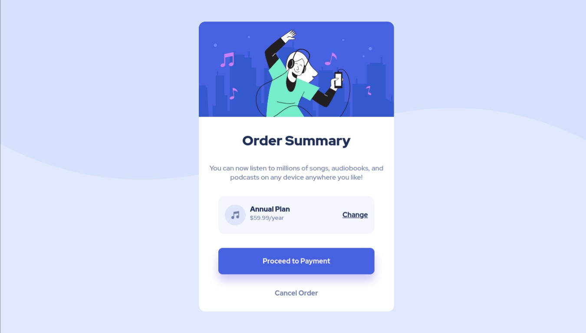

# Frontend Mentor - Order summary card solution

This is a solution to the [Order summary card challenge on Frontend Mentor](https://www.frontendmentor.io/challenges/order-summary-component-QlPmajDUj). Frontend Mentor challenges help you improve your coding skills by building realistic projects.

## Table of contents

- [Overview](#overview)
  - [The challenge](#the-challenge)
  - [Screenshot](#screenshot)
  - [Links](#links)
- [My process](#my-process)
  - [Built with](#built-with)
  - [What I learned](#what-i-learned)
  - [Continued development](#continued-development)
- [Author](#author)

## Overview

It is a good project to reinforce the layout and responsive design in images. A mini project that could be connected to a complete website in which the integration of services with recurring payment plans between company-client. It is very interesting to layout this type of layouts and especially if you start to give functionality.

### The challenge

Users should be able to:

- View the optimal layout for the site depending on their device's screen size
- Adaptable images

### Screenshot

### Links

- Solution URL: [click here](https://github.com/ronitzdev/order-summary)
- Live Site URL: [click here](https://order-summary-ronitzdev.netlify.app/)

## My process

### Built with

- Semantic HTML5 markup
- CSS custom properties
- CSS Grid
- Flexbox
- Desktop-first workflow

### What I learned

### Continued development

I am using more accessibility in images, using the figure tag as a container for the img tag and its alt attribute. This allows blind people to easily recognize what the image is about with the help of technology. We get more users by making a major modification in our html structure.

## Author

- Website GitHub - [ronitzdev](https://github.com/ronitzdev)
- Frontend Mentor - [@ronitzdev](https://www.frontendmentor.io/profile/RoniGerman)
